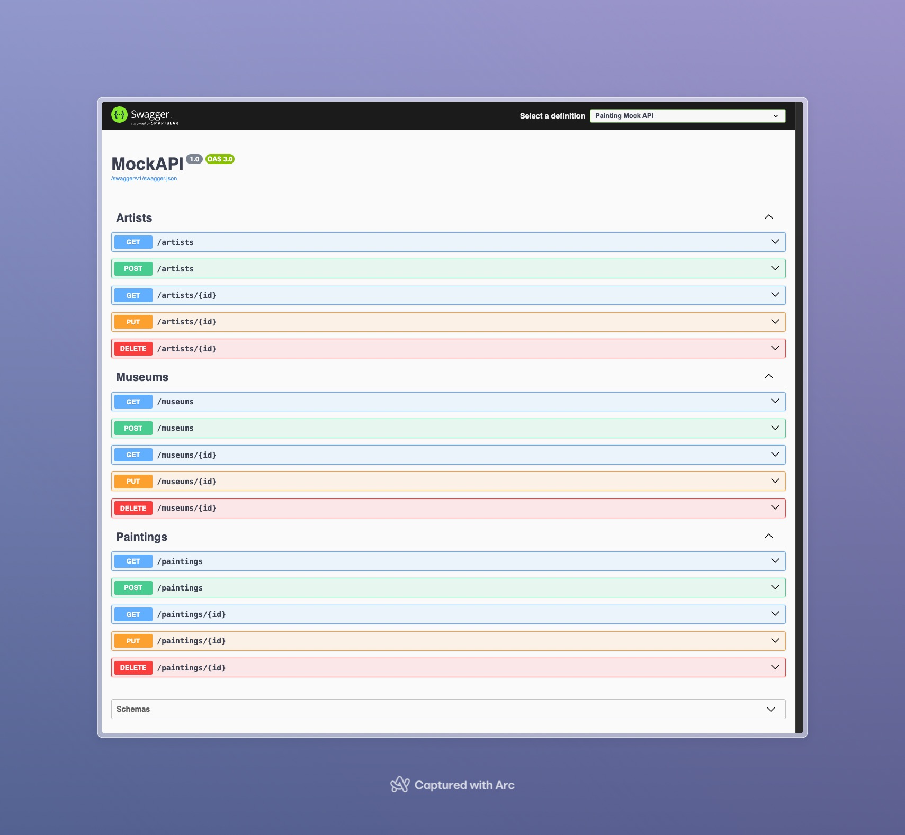

## Painting Mock API

- A simple `mock API` built with `.NET Core` and `EF Core` to manage paintings, artists and museums with CRUD operations.

### Getting Started

1. Clone the repository.
```sh
git clone https://github.com/otegecmis/painting-mock-api.git
```

2. Navigate to the MockAPI directory.
```sh
cd painting-mock-api/MockAPI
```

3. Restore dependencies.
```sh
dotnet restore
```

4. Run the application.
```sh
dotnet run
```

### API Documentation

Access `Swagger UI` at `/swagger` to test the API.

<div style="float: left;">
    
</div>
